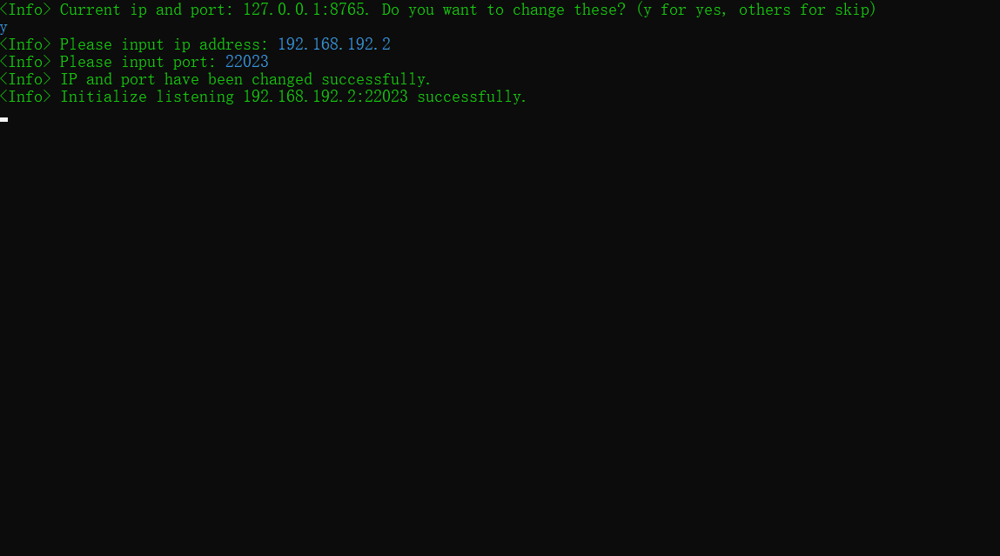

# TinyWarriorServer

Language：English | [简体中文](README.zh-CN.md)

## Introduction

This is a proprietary server designed in C# for [TinyWarrior](https://github.com/ZerglingV/TinyWarrior). The server supports multiple game rooms, each of them can contain 2 to 5 people online, its default port is 8765 (the server allows custom IP and port).

Thank you for playing and please feel free to put any suggestions or bugs forward if you have any of them during the play.

## Installation

After Download released <strong><em>TinyWarrior.exe</em></strong>, run it directly to enter the server settings.

## Server settings and commands

Formal commands (input in the console, case insensitive) :

| Command        | Function                                |
| -------------- | --------------------------------------- |
| shutdown       | shutdown the server                     |
| clear          | clear the console                       |
| monitor pause  | monitor[^1] pause                       |
| monitor resume | monitor resume                          |
| show clients   | show all connecting cilents             |
| remove clients | remove all connecting cilents           |
| show rooms     | show all existing rooms                 |
| remove rooms   | remove all existing rooms               |
| send           | send messages to all connecting clients |

[^1]: The monitor is used to observe whether the player connection is valid and the game in the room is over. It will remove the player with an invalid connection and the room with a finished game to prevent the server from having invalid objects.

Test commands (input in the console for testing only, case insensitive. The formal version all of these commands will be removed):

| Command | Function                               |
| ------- | -------------------------------------- |
| win     | the player with index zero wins        |
| dead    | the player with index zero loses       |
| leaver  | the player with index zero leaves game |
| ‘       | add a room for testing                 |

## Server screenshots

<b>custom IP and port</b>

## Copyright

Part of the contents and pictures are from the network, the copyright belongs to the original author or website. If there is copyright infringement, please contact me to delete.
